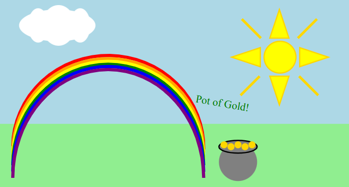

Here is an image I created in the SVG format by writing up the code.


Here is the code that makes up this image:
 ```<svg width="550" height="300" xmlns="http://www.w3.org/2000/svg">
  <!-- Define a rectangle with a white fill -->
  <rect x="0" y="0" width="550" height="300" fill="lightblue"/>
  
  <text x="60%" y="35%" font-size="17" fill="green" transform="rotate(10)">Pot of Gold!</text>
  <circle cx="80%" cy="30%" r="25" fill="yellow" stroke="gold" stroke-width="2"/>
 <!-- <polygon points="400,5 350,150 450,150" fill="orange" /> decrease by 5, add 20, increase 15, decrease 40, decrease 25, decrease 40/> -->
  <polygon points="439,165 424,120 454,120" fill="yellow" stroke="gold" stroke-width="2" />
  <polygon points="464,140 449,95 479,95" fill="yellow" stroke="gold" stroke-width="2" transform="rotate(90 439 65)" />
  <polygon points="514,242 499,197 529,197" fill="yellow" stroke="gold" stroke-width="2" transform="rotate(-90 439 165)" />
  <polygon points="439,315 424,270 454,270" fill="yellow" stroke="gold" stroke-width="2" transform="rotate(180 439 165)" />
   <line x1="380" y1="30" x2="410" y2="60" style="stroke:gold;stroke-width:4" />
   <line x1="498" y1="30" x2="468" y2="60" style="stroke:gold;stroke-width:4" />
   <line x1="408" y1="120" x2="378" y2="150" style="stroke:gold;stroke-width:4" />
   <line x1="470" y1="120" x2="500" y2="150" style="stroke:gold;stroke-width:4" />
   

  
  <rect x="0" y="65%" width="550" height="120" fill="lightgreen"/>
  <circle cx="68%" cy="85%" r="30" fill="grey"/>
  <ellipse cx="68%" cy="77%" rx="30" ry="10" fill="grey" stroke="black" stroke-width="2"/>
  <circle cx="64%" cy="76%" r="5.5" fill="gold"/>
  <circle cx="66%" cy="77%" r="5.5" fill="gold"/>
  <circle cx="70%" cy="77%" r="5.5" fill="gold"/>
  <circle cx="68%" cy="76%" r="5.5" fill="gold"/>
  <circle cx="72%" cy="76%" r="5.5" fill="gold"/>
	
	
	<!-- Red -->
  <path d="M20,230 A15.5,15 0 1,1 320,235" stroke="red" stroke-width="5" fill="none"/>
  <!-- Orange -->
  <path d="M20,240 A13.2,13 0 1,1 320,240" stroke="orange" stroke-width="5" fill="none"/>
  <!-- Yellow -->
  <path d="M20,250 A10.75,11 0 1,1 320,250" stroke="yellow" stroke-width="5" fill="none"/>
  <!-- Green -->
  <path d="M20,260 A8.5,9 0 1,1 320,260" stroke="green" stroke-width="5" fill="none"/>
  <!-- Blue -->
  <path d="M20,270 A6.35,7 0 1,1 320,270" stroke="blue" stroke-width="5" fill="none"/>
  <!-- Indigo -->
  <path d="M20,280 A4.4,5 0 1,1 320,280" stroke="purple" stroke-width="5" fill="none"/>
  
   <ellipse cx="90" cy="40" rx="60" ry="25" fill="white" />
   <ellipse cx="90" cy="90" rx="27" ry="16" fill="white" transform="rotate(90 100 50)" />
   <ellipse cx="90" cy="58" rx="32" ry="26" fill="white" transform="rotate(90 100 50)" />
   <ellipse cx="90" cy="25" rx="27" ry="16" fill="white" transform="rotate(90 100 50)" /> ``` 

	

	
  

  <svg width="400" height="200">
</svg>
</svg>
